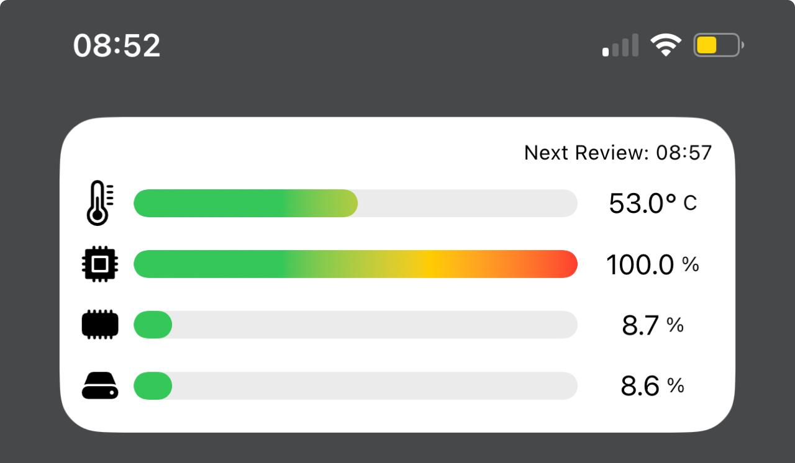

# FlorShop API Rest

ServerMonitoring es una app que posee un widget para iOS que sirve para monitorear un servidor local.

### Requisitos mínimos

* Se requiere del servicio o API que se ejecuta en el servidor para funcionar, esta se encuentra en mi repositorio.

* Es suficiente con ejecutar el archivo `ServerMonitoring.xcodeproj` en Xcode.

### ¿Que Características tiene el Widget?
* Mide la temperatura del servidor.
* Mide la carga en el procesador.
* Mide la carga en la memoria RAM.
* Mide el almacenamiento SSD.
* Está escrito íntegramente con Swift.
* Uso de Alamofire para las peticiones.
* Y muchos detalles más ...

## Imagen de Muestra

### Sobre Pull Request al proyecto

* **NO SE ACEPTAN PR** de código sobre el proyecto.

*Esto porque quiero que sea una Widget que muestre mis habilidades en programación.*

### ¿Cómo puedo contactarte?

## Hola, mi nombre es Angel Curi. Soy el creador de Flor Shop y Flor API Rest.

Soy ingeniero de sistemas desde hace mas de 3 años. Combino mi trabajo como desarrollador RPA y desarrollando Apps en mis tiempos libres y estoy escuchando ofertas sobre Programacíon iOS puedes contactarme desde mi perfil de ****.

### En mi perfil de Linkeding tienes más información

